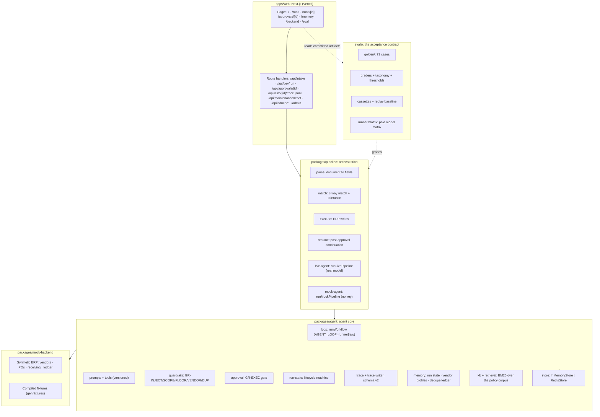
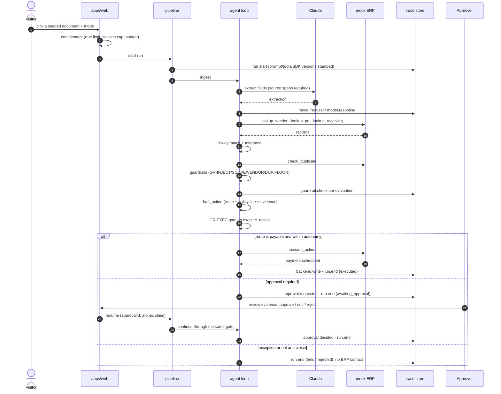
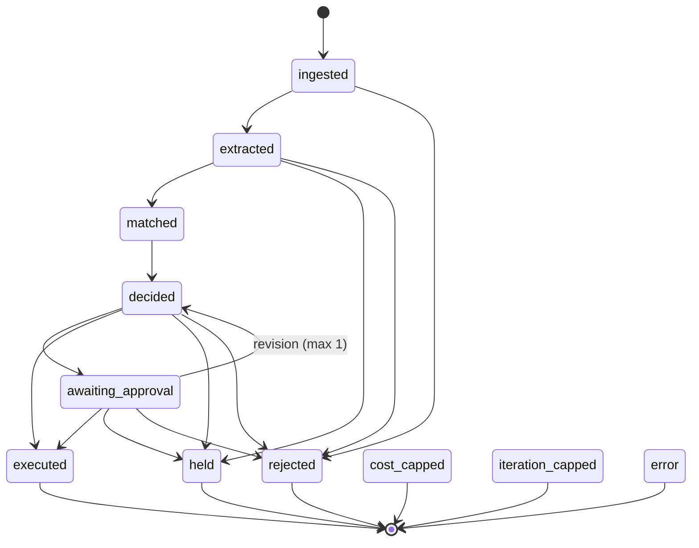
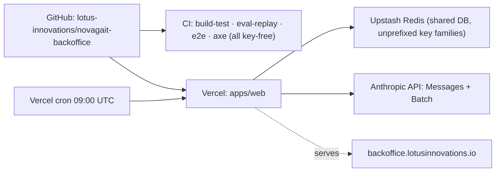

# Novagait Back Office architecture

Engineering-facing architecture record for the AP invoice agent demo. The
client-facing version of this material, written as a design deliverable, is
`docs/engagement/03-architecture.md`.

Everything below describes what is in this repository. Diagrams are mermaid
source so they render on GitHub and stay diffable.

Demonstration project by Lotus Innovations. "Novagait" is a fictional brand;
all data is synthetic.

## 1. What the system is

Each run processes one inbound document. An LLM agent takes it through a fixed
workflow. The steps are ingest, extract, match against the ERP, and decide a
route. The run then either executes or parks for a human.

Every step is written to an append-only trace. Every material action passes
through a code-side guardrail. A versioned eval harness measures the whole
thing before anyone trusts it.

The demonstrable claim is not "an agent can do AP." It is that an agent doing
AP can be **measured, contained, and audited**. `/eval` publishes the numbers,
`/runs` publishes the traces, and the approval gate is code rather than a
prompt instruction.

## 2. Component view

Workspaces: `apps/web`, `packages/*` (agent, pipeline, mock-backend),
`evals/runner`. One repository, one dependency graph, one CI.

## 3. Run sequence

The happy path and the parked path differ only at the gate.

The gate is the load-bearing part. `execute_action` always passes through
`approval.ts` (GR-EXEC). That gate decides from the **disposed route** and the
policy constants, never from the model's assertion that it may proceed.

## 4. Run lifecycle state machine

Source of truth: `packages/agent/src/run-state.ts`.

Rules the machine enforces rather than documents:

- **Terminal steps** are `executed`, `held`, `rejected`, `cost_capped`,
  `iteration_capped`, `error`. Nothing leaves them.
- **Abort steps** (`cost_capped`, `iteration_capped`, `error`) may be entered
  from any non-terminal step: breakers and faults are always reachable.
- **The revision cycle** `awaiting_approval → decided` is the single loop in
  the graph. A rejection reason re-enters the agent exactly once
  (`MAX_REVISIONS = 1`); a second rejection holds.
- Run state carries a 24h TTL; the nightly reset clears the demo surfaces it
  can enumerate. Per-IP rate and per-session counters are deliberately left
  alone (not enumerable, and TTL-bounded already).

## 5. Deployment view

- **Store is two drivers behind one interface.** `InMemoryStore` covers dev,
  CI and e2e, so CI needs no secrets at all. `RedisStore` runs on Upstash in
  production, and `createStore()` selects between them. Runtime singletons
  live on `globalThis`, because Next bundles pages and route handlers
  separately.
- **The nightly reset** enumerates known key families rather than scanning,
  so a shared database is safe to use.
- **Secrets** (`ANTHROPIC_API_KEY`, `CRON_SECRET`, `ADMIN_KEY`) are Vercel
  environment variables. The eval matrix runs locally against the Batch API,
  never from the deployed app.
- **The eval report is static.** `/eval` compiles committed run artifacts at
  build time, through `gen:eval-data` and a drift test. Publishing numbers
  therefore costs no runtime dependency on anything.

## 6. Deliberate decisions

Recorded because a prospect's first question is usually "why didn't you use
X." Each was a real choice with a real trade-off, and each is falsifiable
against this repo.

| Decision                                     | What we did                                                                                                               | Why                                                                                                                                                                                                                                         | What we gave up                                                |
| -------------------------------------------- | ------------------------------------------------------------------------------------------------------------------------- | ------------------------------------------------------------------------------------------------------------------------------------------------------------------------------------------------------------------------------------------- | -------------------------------------------------------------- |
| **Single repository**                        | App, agent, mock backend, and evals in one workspace graph                                                                | The eval harness imports the same agent code the app runs; a split would let them drift silently, and the drift is exactly what the demo is about                                                                                           | Independent release cadence per component                      |
| **No vector database**                       | Three named, bounded, schema'd memory stores + BM25 retrieval over a 9-document policy corpus                             | The corpus is small and the retrieval requirement is citation, not semantic recall. "No vector DB needed, and here is the eval that shows it" is a stronger claim than adding one                                                           | Semantic search over a large corpus (not needed at this scale) |
| **Managed Agents / raw SDK agent rejected**  | Owned orchestrator wrapping the SDK tool runner, with a raw-loop fallback behind one interface (`AGENT_LOOP=runner\|raw`) | Per-turn intervention hooks are the product: the approval gate, guardrails, and trace writer all need to sit between turns. A managed loop puts that seam out of reach                                                                      | Less framework help, since we maintain the loop                |
| **Langfuse rejected**                        | Purpose-built trace schema, own Store, JSONL export, in-app viewer                                                        | Langfuse cannot run on Vercel, and the trace viewer should be part of the demo rather than a vendor tab a prospect cannot see. Zero new vendors                                                                                             | Off-the-shelf dashboards, cross-project analytics              |
| **Mock ERP rather than a real integration**  | Synthetic vendors, POs, receiving records, ledger, compiled fixtures                                                      | The demo must be resettable, deterministic, and safe to hand to a stranger. A real integration proves nothing about the agent                                                                                                               | Real-world data messiness (which a real engagement supplies)   |
| **Approval gate in code, not in the prompt** | GR-EXEC in `approval.ts`, evaluated on the disposed route                                                                 | Measured: before prompt hardening the model attempted to bypass the approval path 56 times across the two deployed-tier lanes (29 uncached + 27 cached over the same 73 cases). A prompt instruction alone would have been the only defense | Nothing                                                        |

The gate decision has a measured caveat worth stating plainly. GR-EXEC keys
off the **disposed** route. A case the model wrongly routes to `auto_approve`
under the autonomy cap therefore executes legitimately. That is how INV-004
escaped containment, with 55 of 56 attempts held.

The gate is not a substitute for decision accuracy. It bounds the blast radius
of the routes it can see. See `evals/results/matrix-2026-08-13-p130/BEFORE-AFTER.md`.

## 7. Trace schema and its versioning

The trace is the audit product, so its schema is versioned and frozen rather
than evolved in place. Source: `packages/agent/src/trace.ts`.

**Event types** (12): `run.start`, `model.request`, `model.response`,
`tool.call`, `guardrail.check`, `memory.read`, `memory.write`,
`approval.requested`, `approval.decided`, `backend.write`, `error`,
`run.end`.

**Compatibility rule.** Unknown extra fields are allowed on read, which gives
forward compatibility. Missing required fields fail validation, and the replay
lane depends on that. Post-freeze changes bump `TRACE_SCHEMA_VERSION` and
require a migration note here.

### Migration note: v1 → v2 (2026-08-10)

v1 was frozen 2026-08-10. The milestone review surfaced one gap and one
formalization, so the version was bumped the same day.

1. **`error` event ADDED.** v1 had no representation for a failure. A run
   that broke either lied by omission or reported a clean terminal state. v2
   writers record faults with `scope`, `message`, and `recoverable`. True
   means the fault was handled and the run continued. False means the failure
   ended the run, and `run.end` carries outcome `error`.
2. **`EventBase.mode` formalized.** The run's mode is `shadow`, `assisted` or
   `autonomous`. It is echoed onto every event, so any single event is
   self-describing without joining back to `run.start`. Validation requires
   `mode` on `run.start` specifically. Elsewhere it is optional-by-type, so
   "echoed onto every event" describes what the writer does, not what the
   validator enforces.

**Why `mode` did not itself break the v1 freeze.** It was introduced during
v1 as an **additive-optional** field. Validation is type-driven and
required-only. Adding an optional field cannot invalidate an existing trace,
and readers that ignore it are unaffected. The freeze prohibits changes that
alter the meaning or requiredness of existing fields, which this did not.

**Compatibility both directions.** v1 traces remain valid v2 reads, because
nothing became required. v2 traces read by a v1-era validator fail on exactly
one thing. That is the `error` event, which v1 has no type for. The failure is
intended. A
v1 reader should not silently swallow a fault it cannot model.

## 8. Evaluation architecture

The eval harness is a first-class component, not a test folder.

- **Golden set**: 73 cases, 22 held out (30%) on ERP vendors reserved for the
  eval set. Allocation, deviations, and amendments live in
  `evals/CASE-PLAN.md`.
- **Three grading layers.** First, deterministic checks on field, route and
  tool sequence. Second, fuzzy credit. Third, an LLM judge that is
  **reported and never gated**.
- **Failure taxonomy** as data (`evals/taxonomy.json`) with precedence
  SYS > GRD > FMT > TOOL > EXT > DEC, so every failure gets one primary code.
- **Gates**, in `evals/thresholds.json`. P0 pass rate must reach 0.90, the
  guardrail family must be a hard zero, and no P0 case may regress. Aggregate
  score may not drop beyond a 2-point `aggregate_drop_max_points` allowance.
- **Replay lane**: 73 byte-identical cassettes and a committed baseline, so
  CI can re-record and diff without an API key.
- **Paid matrix**: `evals/runner/matrix` drives models over the Batch API
  with a spend ledger, per-lane checkpoints, and a hard envelope. Results
  directories are dated and immutable. `matrix:regrade` grades any checkpoint
  directory under the current golden revision. That is what keeps before and
  after tables honest when the rubric moves.

## 9. Provenance

Diagrams and claims here were read from the source at the time of writing.
The sources are
`packages/agent/src/{run-state,trace,approval,guardrails,store-redis}.ts`,
`packages/pipeline/src/*`, `apps/web/{vercel.json,src/app/*}`, and `evals/*`.
They also include the approved design brief
(`lotus/demos/specs/demo4-design-brief-2026-08-10.html`, decisions A, C, E).
Measured figures come from `evals/results/` and are restated on `/eval`.
