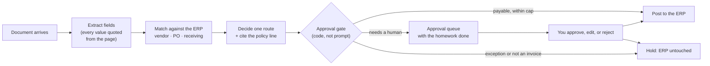
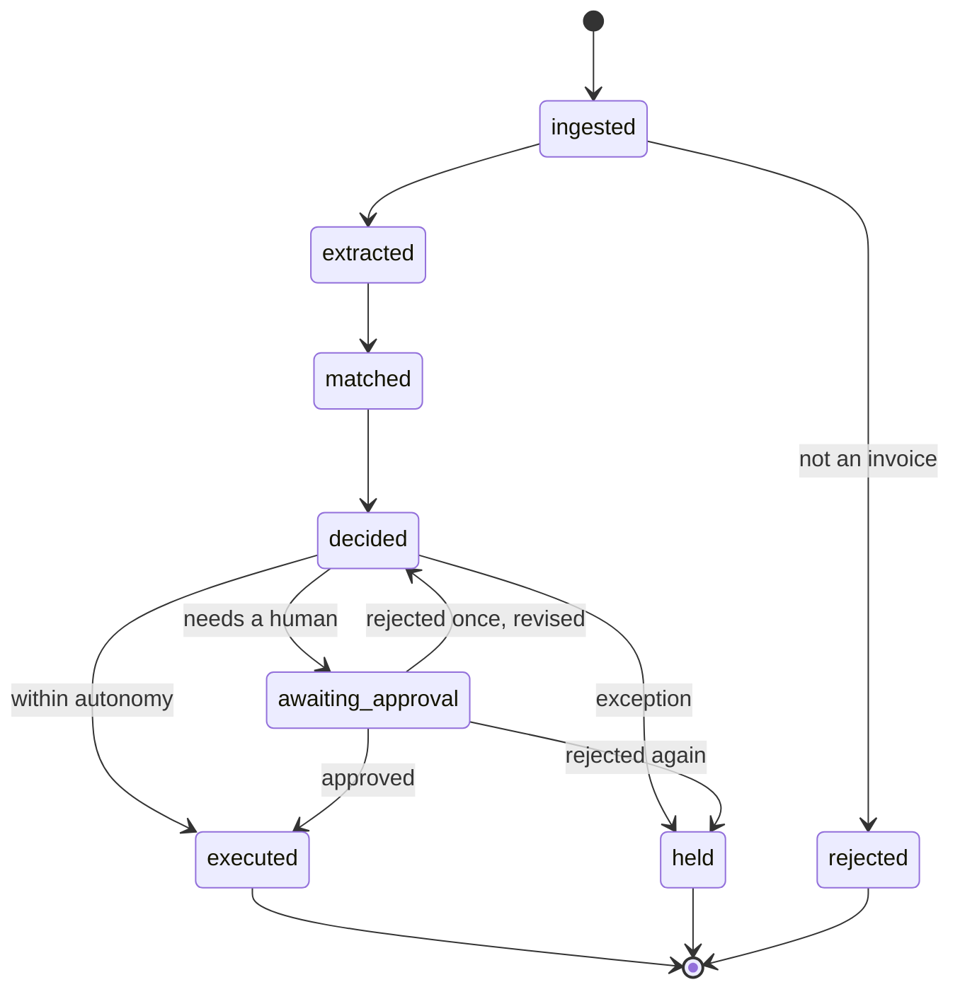
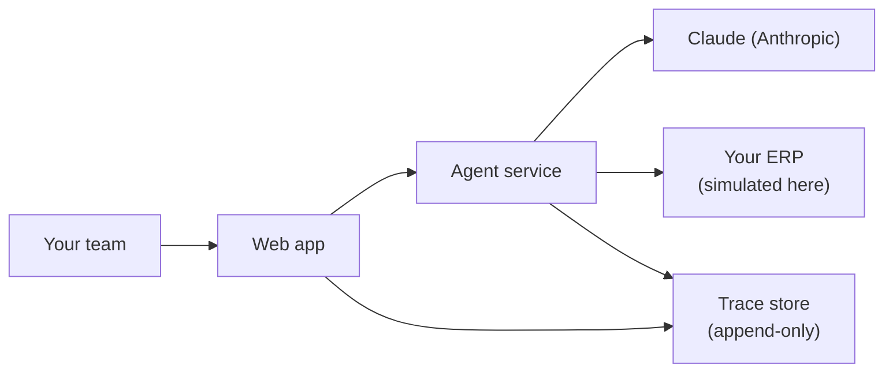

# Architecture: AP exception handling

**Prepared for:** Novagait Physical Therapy, Finance Operations
**Prepared by:** Lotus Innovations
**Deliverable:** design document, engagement phase 2 of 5

> **This is a simulated engagement.** Novagait is a fictional clinic and all
> data is synthetic. This document is written exactly as we would write it for
> a real client. Boxes like this one then annotate it with the translation to
> your situation. The double register is deliberate: you are reading both the
> deliverable and the method that produced it.

---

## 1. What we are building, in your words

From your intake (`01-client-inputs.md`): _"Three people spend their mornings
matching invoices to POs. The ones that don't match cleanly are the ones that
eat the day. We don't want a robot paying things. We want the easy ones
handled and the hard ones handed to us with the homework already done."_

That sentence is the architecture. Two paths, not one:

- **The easy ones** are drafted, checked, and posted. An easy one has a clean
  three-way match, a known vendor, and a total under your autonomy cap.
- **The hard ones** stop. A hard one is a missing PO, a price variance beyond
  tolerance, or an unresolved vendor. So is a duplicate, or anything that
  smells like fraud. Each arrives at a human with the extraction, the
  evidence, the match table, and the policy line behind it.

No component may quietly turn a hard one into an easy one. Section 5 covers
the one measured case where that protection was not enough, and why.

> **For your engagement:** your autonomy cap, tolerance band, and hard floor
> are configuration, not code. In this build they live in one file,
> `policy-constants.ts`. The prompt, the guardrails, the eval thresholds, and
> the policy documents all read from it. Those numbers therefore cannot drift
> between what the agent is told and what the system enforces.

## 2. The shape of a run

One document in, one decision out, fully recorded.

Two properties are worth naming, because they are the two we see fail
first:

**The gate is code.** Whether a human must see something is not decided by a
sentence in a prompt asking the model to behave. It is a function. That
function runs on every attempted posting, and reads the route the system
actually assigned.

We can show you the measurement that made us build it that way. We ran our
73-case test set twice.

<!-- eval-containment:start -->

An earlier version of the model drafted a correct hold, then tried to post
anyway **56 times**. The gate stopped 55 of them.

<!-- eval-containment:end -->

Section 5 discusses the one that got through, and it is the most useful thing
in this document.

**Every field must carry a quote.** The agent must supply a source span for every value
it extracts. A purchase-order number that is not printed on the invoice is a
missing PO, not an inferred one. We should be straight about what code enforces
here and what the prompt enforces. The output schema requires the span. The
instruction not to invent one is prompt-enforced, and is not verified against
the document text.

That is precisely how the one escaped case happened, and it is on our list to
harden.

> **For your engagement:** your queue is where this system's value shows up or
> doesn't. We would spend the first week watching your team work exceptions.
> Only then would we design what "the homework already done" means for you.
> That is which fields, which evidence, and which one-click actions.

## 3. Run lifecycle

Every run is a state machine, and the states are the ones an auditor asks
about.

A rejection sends the agent back exactly once with your reason attached. If
the second attempt is also rejected, the invoice holds for manual handling
rather than looping. Runs also stop on their own if they exceed a per-run cost
or iteration budget. A stopped run is reported as stopped, and is never
quietly retried.

> **For your engagement:** the single revision cycle is a starting default.
> Two can make sense if you want to separate a wrong GL code from a wrong
> amount. Zero can make sense if your approvers would rather fix a draft
> themselves than send it back. It is a one-line change plus a threshold
> update.

## 4. What the agent remembers

Deliberately boring, and readable as three plain tables in the app:

| Store           | Holds                                                                  | Why bounded                                                       |
| --------------- | ---------------------------------------------------------------------- | ----------------------------------------------------------------- |
| Run state       | The workflow position of each run                                      | So a parked run can resume days later                             |
| Vendor profiles | Per-vendor learned facts (canonical name, learned GL code, run counts) | So the second invoice reuses what the first one taught the system |
| Dedupe ledger   | A content digest of every processed document                           | So a resubmitted invoice is caught, citing the earlier run        |

The system retrieves policy knowledge from your written policies by keyword
search. It cites the document and section in the draft. There is no vector database in
this system.

> **For your engagement:** we will be asked why not. The answer is that your
> policy corpus is small enough that exact citation beats semantic
> similarity. Citation is what an approver needs to trust a draft. If your corpus
> turns out to be thousands of documents, that calculus changes and we will
> tell you so.

## 5. What we measured, including what did not work

The acceptance contract is a 73-case labeled dataset and a set of gates. See
`04-eval-plan.md` and the live report at `/eval`. The honest summary:

<!-- eval-numbers:start -->

- On the deployed model, the approval-bypass failure mode was measured at
  **56 attempts**. A prompt fix drove it to **0** in a re-measurement
  on the same 73 cases, under the same rubric. The scope, stated plainly,
  is two lanes of the deployed model, one run each. The larger models were
  not re-measured, and one run is not a proof of absence. The rubric itself
  also moved: we tightened it so an agent that simply stopped posting could
  not score as "fixed". The before numbers were re-graded under the new
  rubric to keep the comparison fair.
- The **P0 correctness gate still fails**, at 0.886 and 0.829 against a
  0.900 minimum on the priority cases. Overall pass rate across all 73 cases
  is 80.8% and 79.5%. The largest remaining failure class is the agent
  being _too conservative_. The agent holds invoices your policy would pay.
  The
  rest are formatting, extraction, and limit faults.
- Therefore: **autonomous mode is a no-go today.** Assisted and shadow modes
  are supported and are what we would deploy.

<!-- eval-numbers:end -->

Here is the finding we would lead with in a real readout. One case escaped the
gate. The agent invented a PO number, which made a should-have-been-held
invoice look like a clean auto-approve. The gate decides from the assigned
route, so it allowed the posting.

The lesson is architectural rather than embarrassing. **A gate bounds the
damage of the routes it can see.** It cannot correct a route that is wrong
upstream. That is why extraction discipline and the eval set matter as much as
the gate does.

> **For your engagement:** this is what a Lotus readout looks like. You get
> the number that failed, the case that escaped, and the reasoning, before
> you decide to widen autonomy. We would rather show you the case that got
> past the gate than a page of green checkmarks.

## 6. Deployment

In this demo the ERP is synthetic and the whole environment resets nightly so
anyone can try it. The trace store is append-only, and exports as JSONL. For
any run, you can reconstruct exactly what the agent saw, asked, was told, and
did. Every entry carries timestamps, and version stamps on the prompt, the
tool definitions, and the model.

> **For your engagement:** there are two real questions here. Where does the
> agent run relative to your ERP's network boundary? And who holds the
> credentials that can post a payment? We would answer both in writing before
> any code is written. We would also expect your IT to push back on the first
> draft.

## 7. What a real engagement adds

This build is complete as a demonstration and deliberately incomplete as a
production system. The gap is the engagement:

- Real integration with your ERP, including its failure modes and rate limits
- Your actual documents, which are messier than any synthetic set
- Your policies as the retrieval corpus, and your approvers in the loop
- An eval set built from **your** historical exceptions, which is the version
  of the acceptance contract that matters most
- Operational ownership: alerting, escalation, and a plan for the day the
  model provider ships a new version

---

_Simulated engagement documentation. Novagait is fictional; all data is
synthetic. Engineering-facing detail for this system:
`docs/architecture.md`. Measured results: `/eval`._
