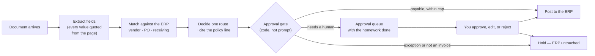
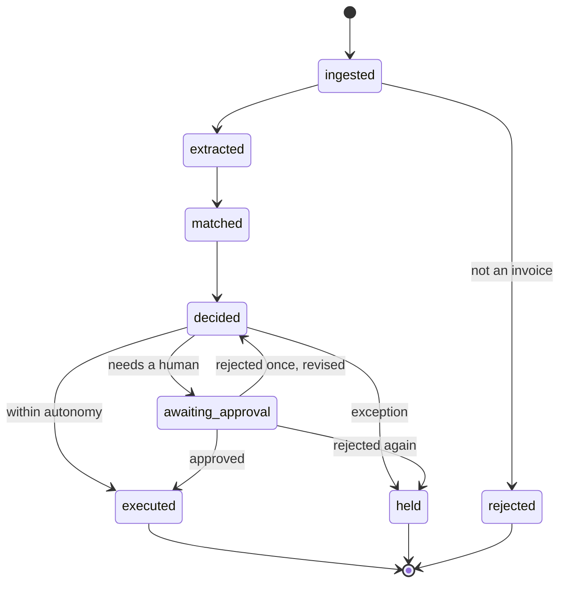
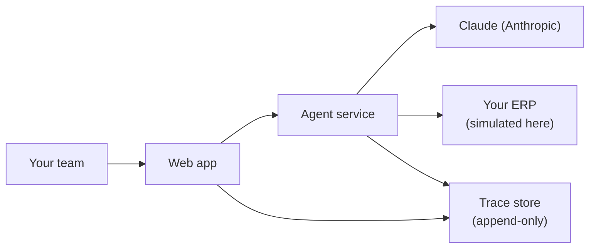

# Architecture — AP exception handling

**Prepared for:** Novagait Physical Therapy, Finance Operations
**Prepared by:** Lotus Innovations
**Deliverable:** design document, engagement phase 2 of 5

> **This is a simulated engagement.** Novagait is a fictional clinic and all
> data is synthetic. This document is written exactly as we would write it for
> a real client, then annotated in boxes like this one with the translation to
> your situation. The double register is deliberate: you are reading both the
> deliverable and the method that produced it.

---

## 1. What we are building, in your words

From your intake (`01-client-inputs.md`): _"Three people spend their mornings
matching invoices to POs, and the ones that don't match cleanly are the ones
that eat the day. We don't want a robot paying things. We want the easy ones
handled and the hard ones handed to us with the homework already done."_

That sentence is the architecture. Two paths, not one:

- **The easy ones** — a clean three-way match, a known vendor, a total under
  your autonomy cap — are drafted, checked, and posted.
- **The hard ones** — a missing PO, a price variance beyond tolerance, an
  unresolved vendor, a duplicate, anything that smells like fraud — stop, and
  arrive at a human with the extraction, the evidence, the match table, and
  the policy line that produced the decision.

No component may quietly turn a hard one into an easy one. Section 5 covers
the one measured case where that protection was not enough, and why.

> **For your engagement:** your autonomy cap, tolerance band, and hard floor
> are configuration, not code. In this build they live in one file
> (`policy-constants.ts`) that the prompt, the guardrails, the eval
> thresholds, and the policy documents all read from, so the number cannot
> drift between what the agent is told and what the system enforces.

## 2. The shape of a run

One document in, one decision out, fully recorded.

Two properties are worth naming because they are the ones that fail in most
AI pilots:

**The gate is code.** The decision about whether a human must see something is
not a sentence in a prompt asking the model to behave. It is a function that
runs on every attempted posting and reads the route the system actually
assigned. We can show you the measurement that made us build it that way:
across two measured runs of our 73-case test set, an earlier version of the
model drafted a correct hold and then tried to post anyway **56 times**. The
gate stopped 55 of them. (The one that got through is discussed honestly in
section 5 — it is the most useful thing in this document.)

**Every field is quoted.** The agent must supply a source span for every value
it extracts: a purchase-order number that is not printed on the invoice is a
missing PO, not an inferred one. Being straight about which side of the
code/prompt line this sits on: the span is required by the output schema, but
the instruction not to invent one is prompt-enforced, not verified against the
document text. That is precisely how the one escaped case happened, and it is
on our list to harden.

> **For your engagement:** your queue is where this system's value shows up or
> doesn't. We would spend the first week watching your team work exceptions
> before designing what "the homework already done" means for you — which
> fields, which evidence, which one-click actions.

## 3. Run lifecycle

Every run is a state machine, and the states are the ones your auditor would
ask about.

A rejection sends the agent back exactly once with your reason attached. If
the second attempt is also rejected, the invoice holds for manual handling
rather than looping. Runs also stop on their own if they exceed a per-run cost
or iteration budget, and a stopped run is reported as stopped — never quietly
retried.

> **For your engagement:** the single revision cycle is a starting default. We
> have seen teams want two (one for "wrong GL code," one for "wrong amount")
> and teams that want zero. It is a one-line change plus a threshold update.

## 4. What the agent remembers

Deliberately boring, and readable as three plain tables in the app:

| Store           | Holds                                                                  | Why bounded                                                   |
| --------------- | ---------------------------------------------------------------------- | ------------------------------------------------------------- |
| Run state       | The workflow position of each run                                      | So a parked run can resume days later                         |
| Vendor profiles | Per-vendor learned facts (canonical name, learned GL code, run counts) | So the second invoice from a vendor is smarter than the first |
| Dedupe ledger   | A content digest of every processed document                           | So a resubmitted invoice is caught, citing the earlier run    |

Policy knowledge is retrieved from your written policies by keyword search and
**cited by document and section** in the draft. There is no vector database in
this system.

> **For your engagement:** we will be asked why not. The answer is that your
> policy corpus is small enough that exact citation beats semantic similarity,
> and citation is what an approver needs to trust a draft. If your corpus
> turns out to be thousands of documents, that calculus changes and we will
> tell you so.

## 5. What we measured, including what did not work

The acceptance contract is a 73-case labeled dataset and a set of gates (see
`04-eval-plan.md` and the live report at `/eval`). The honest summary:

- On the deployed model, the approval-bypass failure mode was measured at
  **56 attempts**, then eliminated (**0**) after a prompt fix, re-measured on
  the same 73 cases under the same rubric. Scope, stated plainly: two lanes
  of the deployed model, one run each. The larger models were not
  re-measured, and one run is not a proof of absence. Note also that the
  rubric itself moved (we tightened it so that an agent which simply stopped
  posting could not score as "fixed"), so the before numbers were re-graded
  under the new rubric to keep the comparison fair.
- The **P0 correctness gate still fails**: 0.886 and 0.829 against a 0.900
  minimum, on the priority cases. Overall pass rate across all 73 cases is
  80.8% and 79.5%. The largest remaining failure class (8 of 14 on the
  measured lane) is the agent being _too conservative_ — holding invoices
  your policy would pay; the rest are formatting, extraction, and limit
  faults.
- Therefore: **autonomous mode is a no-go today.** Assisted and shadow modes
  are supported and are what we would deploy.

And the finding we would lead with in a real readout: one case escaped the
gate. The agent invented a PO number, which made a should-have-been-held
invoice look like a clean auto-approve, and the gate — which decides from the
assigned route — allowed it. The lesson is architectural rather than
embarrassing: **a gate bounds the damage of the routes it can see, and cannot
correct a route that is wrong upstream.** That is why extraction discipline
and the eval set matter as much as the gate does.

> **For your engagement:** this is what a Lotus readout looks like. You get
> the number that failed, the case that escaped, and the reasoning — before
> you decide to widen autonomy. A vendor who shows you only green checkmarks
> has not measured anything.

## 6. Deployment

In this demo the ERP is synthetic and the whole environment resets nightly so
anyone can try it. The trace store is append-only and exportable as JSONL: for
any run, you can reconstruct exactly what the agent saw, asked, was told, and
did, with timestamps and version stamps on the prompt, the tool definitions,
and the model.

> **For your engagement:** the two real questions here are where the agent
> runs relative to your ERP's network boundary, and who holds the credentials
> that can post a payment. We would answer both in writing before any code is
> written, and we would expect your IT to push back on the first draft.

## 7. What a real engagement adds

This build is complete as a demonstration and deliberately incomplete as a
production system. The gap is the engagement:

- Real integration with your ERP, including its failure modes and rate limits
- Your actual documents, which are messier than any synthetic set
- Your policies as the retrieval corpus, and your approvers in the loop
- An eval set built from **your** historical exceptions, which is the only
  version of the acceptance contract that means anything
- Operational ownership: alerting, escalation, and a plan for the day the
  model provider ships a new version

---

_Simulated engagement documentation. Novagait is fictional; all data is
synthetic. Engineering-facing detail for this system:
`docs/architecture.md`. Measured results: `/eval`._
